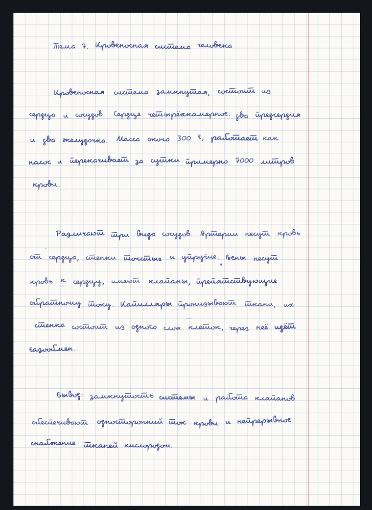

<h1 align="center">konspekt-gen</h1>
<p align="center">Текст на входе — рукописный конспект на выходе</p>

<p align="center">
  <a href="https://github.com/dsixsixsix/konspekt-generator/releases">
    
  </a>
  
  
  
</p>

<p align="center">
  
</p>

<p align="center">
  Многостраничный PDF: связный курсив, живая базовая линия, разный нажим,
  чередование полей по страницам, кляксы и описки с зачёркиваниями.<br>
  Печатается по две страницы на A4 под сшивку тетрадью.
</p>

<p align="center">
  <a href="https://github.com/dsixsixsix/konspekt-generator/releases/latest/download/Konspekt-x64.exe">
    
  </a>
  <a href="https://github.com/dsixsixsix/konspekt-generator/releases/latest/download/Konspekt-arm64.dmg">
    
  </a>
  <a href="https://github.com/dsixsixsix/konspekt-generator/releases/latest/download/Konspekt-x64.dmg">
    
  </a>
</p>
<p align="center"><sub>Сборки не подписаны — при первом запуске система предупредит про неизвестного издателя, это ожидаемо (подробности ниже).</sub></p>

<p align="center">
  <a href="#стек">Стек</a> ·
  <a href="#как-устроено">Как устроено</a> ·
  <a href="#связки-букв">Связки букв</a> ·
  <a href="#тетрадь-из-a4">Тетрадь из A4</a> ·
  <a href="#настольное-приложение">Настольное приложение</a> ·
  <a href="#печать">Печать</a>
</p>

---

```bash
pnpm install
pnpm fonts        # скачать свободные шрифты в public/fonts (один раз)
pnpm dev          # редактор на http://localhost:5180
pnpm batch --merge   # themes/*.txt → out/*.pdf, плюс общий файл
pnpm test
pnpm dist:mac     # приложение: release/Konspekt-arm64.dmg и -x64.dmg
```

## Стек

| Слой | Выбор | Почему |
|---|---|---|
| Сборка | Vite 7 + TypeScript 5.9 | быстрый HMR, ESM без транспиляционного зоопарка |
| UI | React 19 + Tailwind 4 | панель управления из полусотни контролов пишется быстрее всего |
| PDF | pdf-lib + fontkit | векторный текст с точностью до миллиметра, без диалога печати |
| Метрики | fontkit по файлу шрифта | превью и PDF считают ширины из одного источника и не расходятся |
| Пакетный режим | Node 24, нативный TS | те же модули ядра, никакого второго движка |
| Тесты | Vitest | ядро чистое, проверяется без браузера |

## Как устроено

Ядро (`src/core`) не знает ни про DOM, ни про PDF:

```
текст ──layout.ts──► строки и страницы (мм)
                       │
                       ├─handwriting.ts──► штрихи, пятна, описки
                       │                        │
                       │                        ├──► Sheet.tsx  (превью в DOM)
                       │                        └──► pdf.ts     (pdf-lib)
                       │                                 ▲
                       └─booklet.ts──► спуск полос на A4 ─┘
                                            │
                                            └──► BookletMock.tsx (макет сборки)
```

Случайность берётся не из последовательного генератора, а из хеша координат
(`rng.ts`): значение зависит от seed и номеров страницы, строки, слова.
Поэтому правка одного абзаца не перетряхивает всю тетрадь, а превью и PDF при
одном seed совпадают буква в букву.

## Связки букв

Главное ограничение задачи: буквы должны соединяться, иначе сразу видно набор.
Проверено рендером — из кириллических шрифтов Google Fonts связки есть только
у Pacifico, Pattaya и Lobster, и все три декоративные. Marck Script, Bad Script
и Caveat пишут буквы раздельно. Playwrite кириллицы не содержит вовсе.

Поэтому основной шрифт — **Pecita** (SIL OFL, буквы соединены по дизайну,
кириллица есть). Свой почерк, собранный в Calligraphr или FontForge, кладётся
в `public/fonts` рядом и добавляется строкой в `fonts.json`.

Ползунок «дрожание букв» разбивает слово на отдельные глифы и потому рвёт
связки — для связного шрифта он должен стоять на нуле. Вариативность там
держится на уровне слова: смещение, поворот, масштаб, наклон, плотность чернил,
плюс сдвиг всей строки и волна нажима вдоль неё.

## Следы ручки

Два ползунка в разделе «Следы ручки» добавляют то, чего не бывает у набора:

- **Точки и кляксы** — брызги рядом со строкой, капля на отрыве пера у хвоста
  слова, смазанный след под строкой. Пятна привязаны к словам, а не сыплются по
  пустому листу, и не заходят в полосу букв: круглое пятно поверх строки глаз
  читает как надстрочный знак, а не как грязь.
- **Описки и исправления** — ложный старт (обрывок слова, зачёркнутый одним-двумя
  росчерками перед правильным написанием) и наложение (слово обведено повторно с
  микросдвигом). Текст при этом читается целиком: зачёркивается только лишний
  обрывок.

Место под обрывок резервирует `layout.ts` — иначе описка налезала бы на соседнее
слово. Поэтому ползунок «описки» влияет на перенос строк, и текст с описками
вёрстан иначе, чем без них.

## Тетрадь из A4

Печать идёт по две страницы на лист A4 поперёк: лист сгибается пополам, листы
вкладываются друг в друга и сшиваются по сгибу. Половинки при этом идут не
подряд — на внешнем листе рядом стоят последняя и первая страницы, на его
обороте вторая и предпоследняя. Расчёт живёт в `booklet.ts` и один и тот же для
превью, PDF и макета.

```
лист 1 лицо   [16][ 1]      сгиб пополам, лист 2 вкладывается внутрь листа 1
лист 1 оборот [ 2][15]
лист 2 лицо   [14][ 3]
лист 2 оборот [ 4][13]
```

- **Листов A4 в тетрадке** — на 104 страницах одна пачка из 26 листов не
  сгибается: середина выпирает. Книга режется на тетрадки по 4–8 листов,
  тетрадки потом складываются подряд.
- **Первая страница справа/слева** — сторона сшивки. По умолчанию обложка
  справа на лицевой стороне внешнего листа: так тетрадь листается слева направо.
- **Обороты на 180°** — для принтеров, которые переворачивают лист по длинной
  стороне. При перевороте по короткой галочка не нужна.
- Красная линия остаётся на внешнем обрезе: чередование полей по чётности
  страницы совпадает с разворотом собранной тетради.

Проверка раскладки — `readingOrder` в `booklet.ts`: она собирает тетрадь
обратно, и тест требует, чтобы получились страницы 1, 2, 3, … подряд. Вид
«Макет» показывает то же самое руками: листы переворачиваются кликом, соседние
кнопки листают собранную тетрадь.

```bash
pnpm batch --booklet --signature 4        # themes/*.txt → out/*-tetrad.pdf
pnpm batch --booklet --flip-backs         # если принтер переворачивает по длинной стороне
```

## Тексты конспектов

`themes/*.txt` — единственный источник. `pnpm themes` (входит в `pnpm build`)
копирует их в `public/themes` и пишет каталог `index.json`, откуда редактор
берёт список «Готовый конспект»; имя темы — первая строка файла. Копия, а не
симлинк: git на Windows отдал бы вместо текста строку с путём, и в .exe тема
приезжала бы пустой. `public/themes` целиком генерируется и не коммитится.

Текст из .docx достаётся без сторонних библиотек:

```bash
unzip -p конспект.docx word/document.xml \
  | python3 -c "import sys,re;x=sys.stdin.read();print('\n\n'.join(t for t in (re.sub('<[^>]+>','',p) for p in re.findall(r'<w:p[ >].*?</w:p>',x,re.S)) if t.strip()))" \
  > themes/конспект.txt
```

## Шрифт в PDF

Шрифт вшивается в документ целиком: `embedFont(bytes, { subset: false })`.

Сабсеттер fontkit портит часть шрифтов. Для Pecita он отдаёт невалидный поток
CFF (poppler: «Embedded font file may be invalid»), и просмотрщик рисует вместо
кириллицы кашу из случайных глифов. У вариативного Caveat сабсет теряет
контуры и оставляет от текста огрызки. Pacifico, Marck Script и Bad Script
сабсет переживают, но развилки по шрифтам нет: путь один для всех.

Цена решения — размер файла: сжатая Pecita добавляет к документу примерно
0,5 МБ независимо от числа страниц. Конспект на 104 страницы весит 2 МБ.

Отдельная деталь: Pecita лежит под именем `.ttf`, но внутри это OpenType/CFF
(сигнатура `OTTO`). pdf-lib кладёт такой файл в `FontFile2`, из-за чего poppler
предупреждает о несоответствии типа. И poppler, и CoreGraphics (Preview,
Safari) рисуют текст правильно.

Регрессия закрыта тестом `tests/pdf.test.ts`: он достаёт файл шрифта из готового
PDF и сверяет его с исходным, а затем проверяет, что кириллица покрыта глифами.
Тест пропускается, если шрифты ещё не скачаны через `pnpm fonts`.

## Панель и скорость

У каждого параметра в панели есть кнопка «i»: пояснение раскрывается рядом
с ползунком и не превращает боковое меню в стену текста (`src/ui/Field.tsx`).

Конспект на 74 000 знаков — это 104 страницы и 8 500 слов. Наивно они не
живут, поэтому:

- Ширины слов кешируются в единицах шрифта (`measure.ts`). Шейпинг fontkit
  стоил 255 мс на такой текст, повторная вёрстка теперь 4 мс, а кеш не
  сбрасывается при смене кегля.
- Поле ввода неуправляемое, текст уходит наверх после паузы в 250 мс.
  Нажатие клавиши стоит 2–3 мс вместо 50.
- Страницы монтируются по мере подхода к экрану (`Lazy.tsx`), в DOM висит
  два-три листа вместо сотни. Полный DOM собирается 2,2 с — ровно столько
  занимала раньше любая правка текста.
- Перед печатью браузер шлёт `beforeprint`; по нему все листы монтируются
  разом, иначе на бумагу попало бы только видимое (`usePrintMount.ts`).
- Вёрстка и штрихи разведены по разным `useMemo`: ползунки живости письма
  не трогают перенос строк, а тяжёлый пересчёт отстаёт от ввода через
  `useDeferredValue`.

## Настольное приложение

Тот же код работает как программа: Electron открывает собранный `dist`, всё
считается на месте, интернет не нужен.

```bash
pnpm app:dev      # окно поверх дев-сервера, HMR работает
pnpm build        # сборка веб-части в dist
pnpm app          # окно поверх собранного dist
pnpm app:smoke    # автопроверка: страницы, темы, оба PDF, скриншот окна
pnpm dist:mac     # .dmg для arm64 и x64
pnpm dist:win     # .exe (NSIS), нужен Windows или wine
```

Собранный SPA отдаётся не по `file://`, а по своей схеме `app://konspekt/`
(`electron/main.cjs`). Так абсолютные пути `/fonts/...` и `/themes/...`
работают ровно как в браузере, а файлы читаются через `fs` и потому
достаются из `app.asar`. Скачивание PDF открывает системный диалог сохранения
и показывает готовый файл в папке; `Cmd+P` печатает окно.

`pnpm app:smoke` запускает окно без рук: ждёт отрисовки страниц, читает тему
через `app://`, нажимает обе кнопки PDF, проверяет, что получились настоящие
файлы (`%PDF`, `%%EOF`), и кладёт скриншот в `release/smoke.png`.

### Что делает пользователь

```bash
git tag v0.1.0 && git push origin v0.1.0
```

Через несколько минут на странице Releases лежат `Konspekt-x64.exe`,
`Konspekt-arm64.dmg` и `Konspekt-x64.dmg` (без номера версии в имени —
кнопки в начале README ссылаются на `releases/latest/download/...` и не
ломаются при следующем релизе). Дальше:

- Windows: скачать `.exe`, запустить. SmartScreen покажет синее окно про
  неизвестного издателя — «Подробнее», затем «Выполнить в любом случае».
  Установщик не требует прав администратора и ставит программу в профиль
  пользователя, ярлык появляется в меню «Пуск». Удаление — через
  «Параметры → Приложения».
- macOS: скачать `.dmg` по своему процессору (Apple Silicon — arm64,
  Intel — x64), перетащить Konspekt в «Программы». Первый запуск через
  правую кнопку → «Открыть», иначе Gatekeeper не пустит.

Сборки не подписаны: у Apple это 99 $ в год за Developer ID плюс нотаризация,
у Microsoft — сертификат OV или EV. Без них предупреждения останутся, но
программа работает.

### Windows на маке

`electron-builder --win nsis` требует Windows или wine. Варианты:

- GitHub Actions: `.github/workflows/release.yml` собирает `.dmg` на macOS и
  `.exe` на Windows. По тегу `v*` файлы попадают в Releases, откуда их качает
  любой человек без входа в GitHub; артефакты запуска остаются как запасной
  вариант для своих.
- Docker с wine, в отдельной копии репозитория (внутри контейнера ставятся
  линуксовые бинарники, локальный `node_modules` лучше не подставлять):

  ```bash
  docker run --rm -v "$PWD":/project electronuserland/builder:wine \
    /bin/bash -c "corepack enable && pnpm install && pnpm fonts && pnpm dist:win"
  ```
- Локально: `brew install --cask wine-stable`, затем `pnpm dist:win`.

### Настройки

Текст, почерк, разметка, вид и выбранный шрифт сохраняются в `localStorage`
(`konspekt:settings:v1`) и переживают перезагрузку, скачивание и перезапуск
приложения. Из хранилища берутся только поля, совпадающие по типу со
значениями по умолчанию, поэтому старая или битая запись не ломает редактор.
Кнопка «Сбросить настройки» в конце панели очищает запись.

## Печать

- Формат листа задаётся в PDF, поля нулевые — печатать в масштабе 100 %.
- Тетрадью: A4 поперёк, двусторонняя печать, стопку не тасовать — порядок
  страниц в PDF уже печатный (лицо листа 1, оборот листа 1, лицо листа 2 …).
- Печатаешь на настоящей тетрадной бумаге: сними «рисовать клетку», расшей
  тетрадь, подавай листы поштучно, струйный принтер, синие чернила.
- Красная линия чередуется: 1-я страница справа, 2-я слева. Это соответствует
  развороту расшитой тетради.
